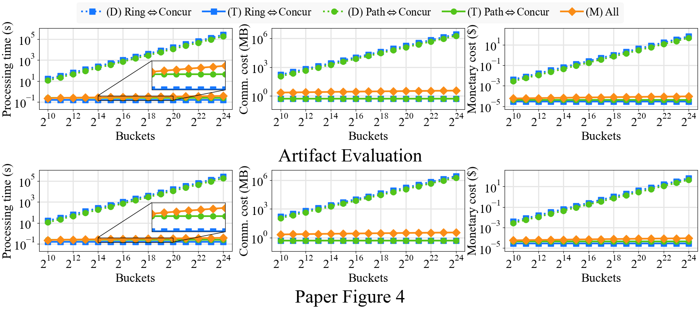
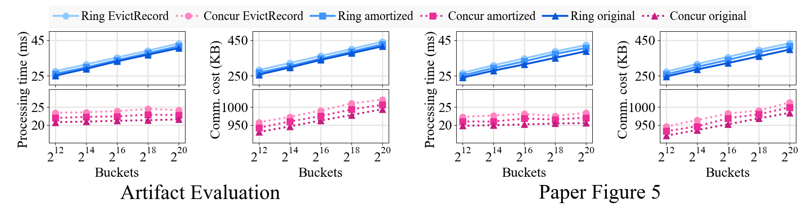
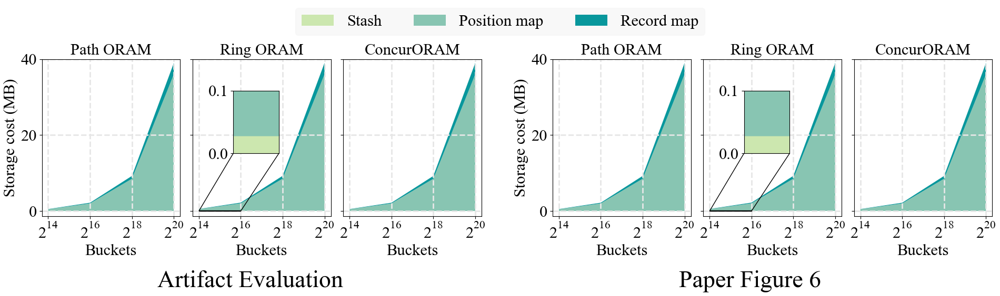
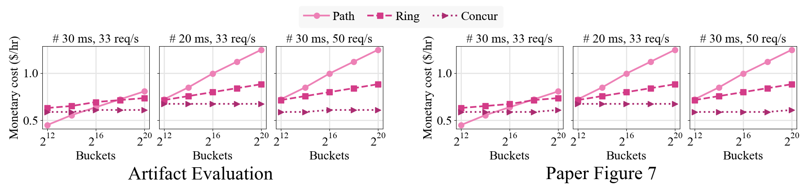
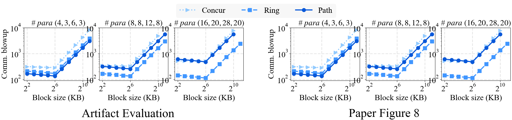
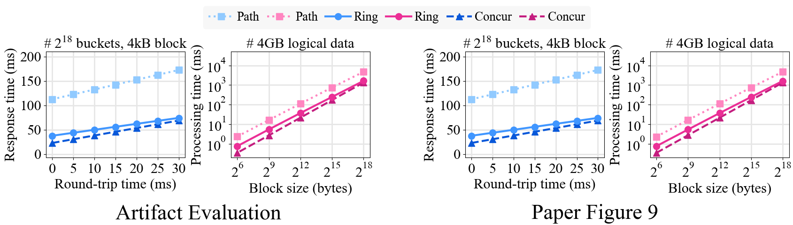
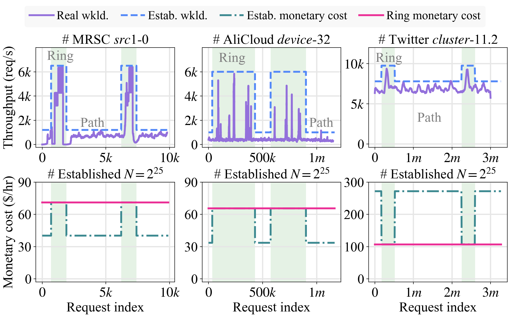
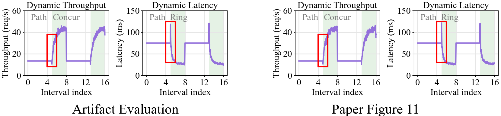

# V-ORAM: A Versatile and Adaptive ORAM Framework

V-ORAM is a versatile and adaptive ORAM framework with service transformation for dynamic workloads. This repository
contains the V-ORAM prototype described in our forthcoming paper at USENIX Security 2025.

Notably, `Full-version.pdf` is the full version of this paper and contains detailed proofs of our stated theorems.

**WARNING**: This implementation is a conceptual prototype for academic research and does not fully meet practical
security/performance requirements. It is NOT suitable for production use.

The implementation is open-sourced under the Apache v2 license ([Lisence](LICENSE)).

# Artifact Evaluation

## Overview

* [Installation](#installation)
* [Figure 4](#figure-4) (<1 compute-minutes)
* [Figure 5](#figure-5) (5 compute-minutes, 90 GB disk, 2 GB RAM)
* [Figure 6](#figure-6) (5 compute-minutes, 90 GB disk, 2 GB RAM)
* [Figure 7](#figure-7) (<1 compute-minutes)
* [Figure 8](#figure-8) (<1 compute-minutes)
* [Figure 9](#figure-9) (10 compute-minutes, 90 GB disk, 16 GB RAM)
* [Figure 10](#figure-10) (<1 compute-minutes)
* [Figure 11](#figure-11) (<1 compute-minutes)
* [Table 3](#table-3) (<1 compute-minutes)

Our experiment does not require specialized cloud servers and can be evaluated on-premises. V-ORAM will generate storage
files to store the data of the binary tree, so please ensure your computer has at least **90 GB** of free storage. 
The RAM usage is roughly estimated based on the RAM usage of the Python process in the Activity Monitor built-in macOS. 
We recommend equip the machine with at least **16 GB** of RAM to prevent the system from automatically killing processes. (Our machine is macOS Sequoia 15.3.2, with 512 GB storage, and 16 GB RAM).

The entire artifact evaluation takes about **20 min** for installation and **2 hr** for computation.

The tree structure of the project is as follows:

```sh
V-ORAM
├── src                 # The prototypes of V-ORAM and three selected ORAMs
│   ├── data/
│   ├── AccessInfo.py
│   ├── BTree.py
│   ├── ConcurORAM.py
│   ├── Path_ORAM.py
│   ├── Ring_ORAM.py
│   ├── V_ORAM.py
│   └── utils.py
├── data                # Real-world datasets and generated storage files
│   └── real_workloads.zip
├── test/               # Read/write tests
├── artifacts           # Scripts used in this artifact evaluations
│   ├── outputs/
│   ├── paper_data/
│   ├── paper_figs/
│   └── FigXX_fig_scripts.py
├── requirements.txt
├── README.md
├── config.py
├── Full-version.pdf
└── LICENSE
```

The prototypes of V-ORAM and three selected ORAMs are located in the `~/V-ORAM/src/`. Real-world datasets and generated
storage files are stored in the `~/V-ORAM/data/` .

To ensure the correctness of V-ORAM and three ORAMs, we provide some read/write tests located in the `~/V-ORAM/test/`.

Files related to this artifact evaluations are in the `~/V-ORAM/artifacts/`, including experimental data and resultant
figures in the paper. All generated results are saved as `.csv` files, and figures are saved as PDFs in
the `~/V-ORAM/artifacts/outputs/`.

All experiments can be run in parallel, except Figures 7, 9, and 10, which require the results from Figure 5. We
recommend following the order specified in this README.

We provide shell commands for all figure scripts, which automatically prepare the data, draw the resultant figures, and
generate comparisons with the figures in our paper. Concretely:

* `-p` prepares the necessary data for drawing figures or processing datasets to obtain their statistics.
* `-d` generates resultant figures with the same style presented in the paper.
* `-c` compares the figures generated by the artifacts with those in the paper.

Additionally, all the experiments maintians a progress bar to help estimate the remaining time. (If the progress bar
always wraps to new lines, please manually extend the command line's width utill the process bar does not wrap. This
should resolve the issue.)

**Notes**:

* We recommend editing the corresponding Python files if you want to modify experiment settings. However, this may
  result in unpredictable changes to the figure layout.
* All the provided commands are rooted at `~/V-ORAM/`.s

## Installation

After cloning this repository, you need to:

1. Check if there is sufficient storage space in the current directory. We recommend keeping at least 90GB of free space.

   ```sh
   df -h .
   ```

2. Set up the environments. We use `Python 3.8` as the runtime environment. Additionally, please execute the following
   command to install the necessary dependencies:

   ```sh
   pip3 install virtualenv
   virtualenv .venv --python=python3.8
   source .venv/bin/activate
   pip3 install -r requirements.txt
   ```

3. Unzip the datasets. The stripped datasets we use can be found in `~V-ORAM/data/real_workloads.zip`. You can extract
   them using the following command:
   ```shell
   cd ./data
   unzip real_workloads.zip
   ```
   The full datasets are available through the following links.

   MSRC：https://iotta.snia.org/traces/block-io/388

   AliCloud：https://github.com/alibaba/block-traces

   Twitter：https://github.com/twitter/cache-trace

   **Notes**:

   * To simplify evaluations, we only include the necessary subsets of the datasets. Specifically, we use partial traces
     from `src1-0` in MSRC, `device32` in AliCloud, and `cluster11.2` in Twitter.

   * We only provide statistics for two medical image datasets to estimate the ORAM parameter settings. The complete
     datasets are not included in this evaluation. This does not affect the artifacts' integrity and correctness.

4. Run tests. We recommend reviewers execute all tests in the `~/V-ORAM/test/` before starting the evaluations. The required dependency `pytest` is already installed in the previous step.

   ```sh
   pytest		# <1 min
   ```

## Figure 4

```sh
python3 ./artifacts/Fig4_transformation.py -pdc	# <1 min
```

The above command runs V-ORAM under various workloads and compares its performance with two baselines (D and M)
mentioned in Section 6.1 of the paper.

The generated data is saved in `trans_time_comm.csv`, and the two output figures are `Fig4_transformation.pdf`
and `Fig4_transformation_compare.png`.

<details>
<summary>Sample Figure 4 output</summary>

</details>

## Figure 5

```sh
python3 ./artifacts/Fig5_EvictRecord_prfm.py -pdc	# 10 min
```

The above command runs V-ORAM and records the execution of EvictRecord during the process. The three costs in the
figures are described in Section 6.2 -> "EvictRecord costs" of the paper.

The generated data is saved in `evict_record_time_comm.csv`, and the two output figures are `Fig5_EvictRecord_prfm.pdf`
and `Fig5_EvictRecord_prfm_compare.png`.

<details>
<summary>Sample Figure 5 output</summary>

</details>

## Figure 6

```sh
python3 ./artifacts/Fig6_storage_cost.py -pdc	# 5 min
```

The above command estimates the stash size of different ORAMs and compares it with the sizes of the Position Map and
Record Map.

The generated data is saved in `storage_cost.csv`, and the two output figures are `Fig6_storage_cost.pdf`
and `Fig6_storage_cost_compare.png`.

<details>
<summary>Sample Figure 6 output</summary>

</details>

## Figure 7

```sh
python3 ./artifacts/Fig7_decision_choose_ORAM.py -pdc	# <1 min
```

The above command runs three ORAMs under various system performance requirements and estimates their monetary costs for
various bucket sizes.

The generated data is saved in `choose_ORAM.csv`, and the two output figures are `Fig7_decision_choose_ORAM.pdf`
and  `Fig7_decision_choose_ORAM_compare.png`.

<details>
<summary>Sample Figure 7 output</summary>

</details>

## Figure 8

```sh
python3 ./artifacts/Fig8_opt_block_size.py -pdc	# <1 min
```

The above command compares the communication blowup of three ORAMs under different parameter settings and block sizes.

The generated data is saved in `opt_block_size.csv`, and the two output figures are `Fig8_opt_block_size.pdf`
and `Fig8_opt_block_size_compare.png`.

<details>
<summary>Sample Figure 8 output</summary>

</details>

## Figure 9

```sh
python3 ./artifacts/Fig9_realistic_settings.py -pdc	# 100 min
```

The above command evaluates V-ORAM performance under two realistic settings (different RTT values and block sizes). The
RTT experiments are derived from the results of Figure 5, while the block sizes experiments require re-running V-ORAM.

The generated data for varying block sizes is saved in `various_block_size.csv`, and the two output figures
are `Fig9_realistic_settings.pdf` and  `Fig9_realistic_settings_compare.png`.

<details>
<summary>Sample Figure 9 output</summary>

</details>

## Figure 10

```sh
python3 ./artifacts/Fig10_real_world_case_studies.py -d	# <1 min
```

The above command reads three real-world datasets and simulates V-ORAM performance. Since the results are stable, we
use `-d` to directly plot the figure.

The generated output is `Fig10_real_world_case_studies.pdf`.

<details>
<summary>Sample Figure 10 output</summary>

</details>

## Figure 11

```sh
python3 ./artifacts/Fig11_simulated_workloads.py -pdc	# <1 min
```

The abive command runs V-ORAM under simulated workloads and records performance during execution.

The generated data is saved in `simulated_workloads.csv`, and the two output figures are `Fig11_simulated_workloads.pdf`
and `Fig11_simulated_workloads_compare.png`.

<details>
<summary>Sample Figure 11 output</summary>

</details>

## Table 3

```sh
python3 ./artifacts/Tab3_real_case_study_para.py -p	# <1 min
```

The above command reads the datasets, calculated statistics, and provides the estimate tree heights, recommended block
sizes, and communication blowups under Ring ORAM.

	# Processing datasets ...
		# Reading MSRC/src1_0_tripped.csv ...
		Total data volume: 273.46GB, average file size: 6.82kB
		Optimal block size: 4kB,	blowup: 130.82k,	tree height: 25
	
		# Reading AliCloud/io_traces_32.csv ...
		Total data volume: 499.35GB, average file size: 29.51kB
		Optimal block size: 16kB,	blowup: 111.59k,	tree height: 23
	
		# Reading Twitter/cluster11.2_tripped.csv ...
		Total data volume: 267.71GB, average file size: 0.38kB
		Optimal block size: 256B,	blowup: 169.51k,	tree height: 29
	
		# ChestX-ray8 datasets ...
		Total data volume: 41.96GB, average file size: 392.45kB
		Optimal block size: 256kB,	blowup: 95.30k,	tree height: 16
	
		# COVIDx datasets ...
		Total data volume: 29.02GB, average file size: 358.76kB
		Optimal block size: 256kB,	blowup: 98.16k,	tree height: 15
	
		The detailed code of getting ChestX-ray8 and COVIDx statistics is ommited here

